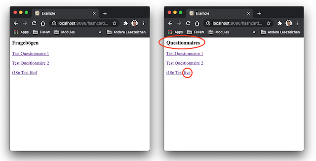

# Lektion 2: Servlet Komponenten

## Einleitung
In dieser Lektion erhalten sie zusätzliche Informationen zur Komponente *Servlet* wie:

* Servlet-Container
* ServletRequest und ServletResponse
* ServletContext
* Servlet Lifecyle

Neu werden zwei weitere Basiskomponenten der Servlet Technologie eingeführt:

* Filter
* Listener

Sie kennen nach dieser Lektion die elementaren Bausteine, die in jeder Java Webapplikation zum Einsatz kommen und die von jedem Web Famework, z.B. auch von [Spring MVC](https://docs.spring.io/spring/docs/current/spring-framework-reference/web.html#mvc) intensiv genutzt werden. Es ist deshalb wichtig, dass sie ein gutes Verständnis von diesen Basiskomponenten haben, um auch die Funtionsweise der Frameworks verstehen zu können - und ohne Einsatz Frameworks und Libraries werden sie schlussendlich keine eigene Webapplikation implementieren!

## Ressourcen
Die Slides zu dieser Lektion sind auf [MS Teams](https://teams.microsoft.com/l/channel/19%3aGUtpEacwnFN-v0_PeG-fdUzDooai_4HhL8QwKr7hnRk1%40thread.tacv2/Allgemein?groupId=85012943-9402-4082-930e-4f0cc9356e0f&tenantId=9d1a5fc8-321e-4101-ae63-530730711ac2) abgelegt. Die Slides gibt es in 2 Versionen:

* eine druckbare Version unter Tab *Dateien* im Ordner `02`
* eine vertonte Version im gleichen Ordner.

Alle Arbeitsblätter finden sie ebenfalls auf [MS Teams](https://teams.microsoft.com/_#/school/files/Allgemein?threadId=19%3AGUtpEacwnFN-v0_PeG-fdUzDooai_4HhL8QwKr7hnRk1%40thread.tacv2&ctx=channel&context=01&rootfolder=%252Fteams%252Fwebfr_M365%252FFreigegebene%2520Dokumente%252FGeneral%252F01).

Der Quellcode eines Arbeitsblattes und auch die jeweiligen Lösungen werden über Gitlab bereitgestellt.

Hier ein paar Links aus dem Internet, die aus meiner Sicht nützlich und aktuell sind:
* Overview aus JSR 369: Die Spezifikation ist als [PDF](https://download.oracle.com/otndocs/jcp/servlet-4-final-eval-spec/index.html) verfügbar.
* [Servlet Filter](https://www.javatpoint.com/servlet-filter) von [Javatpoint](https://www.javatpoint.com/)
* [Event and Listener in Servlet](https://www.javatpoint.com/Event-and-Listener-in-Servlet) von [Javatpoint](https://www.javatpoint.com/)

## Theorie

Lesen sie das Kapitel "Theorie" im Arbeitsblatt 4. 

Sie sollten nun die gesamte Verarbeitungskette eines HTTP Requests (Browser-Server-Browser) einer einfachen Java Webapplikation verstehen und erklären können.

* Welche Rolle spielt das Servlet?
* Welche Rolle spielt der Filter?
* Welche Rolle spielt der Listener?
* Wie wird eine URL verarbeitet, so dass sie schlussendlich beim Servlet ankommt?

## Arbeitsblätter

**Arbeiten sie in einem 2er-Team. Es macht mehr Spass!**

### AB4
In der **Aufgabe 1** implementieren sie einen _Filter_, der die URLs jedes HTTP Requests aufzeichnen soll. Mir diesem Montoring erhalten sie einen Überblick über die verwendeten URLs, also welche Webpage in ihrer Applikation am meisten aufgerufen wird.

In der **Aufgabe 2** implementieren sie einen _Listener_. Sie wollen ihrer Webapplikation in zwei verschiedenen Mode starten können:

1. Mode "test": Zu Testzwecken wird das `QuestionnaireRepository` beim Starten der Webapplikation mit mehreren Entitäten "Questionnaire" gefüllt.
2. Mode "productive": Das `QuestionnaireRepository` ist beim Starten der Webapplikation leer.

### AB5
In diesem Arbeitsblatt lernen sie den Umgang mit den Wrapper Klassen. Mit sollen einen [HttpServletResponseWrapper](https://docs.oracle.com/javaee/7/api/javax/servlet/http/HttpServletResponseWrapper.html) einsetzen, um die Response, die das Servlet generiert, zu bearbeiten. Konkret sollen sie in einem Filter alle deutschen Wörter in der Response auf Englisch übersetzen.

Abbildung 1 zeigt ein Beispiel. 

Abbildung 1: Beispiel der Englisch-Übersetzung auf der Übersichtsseite