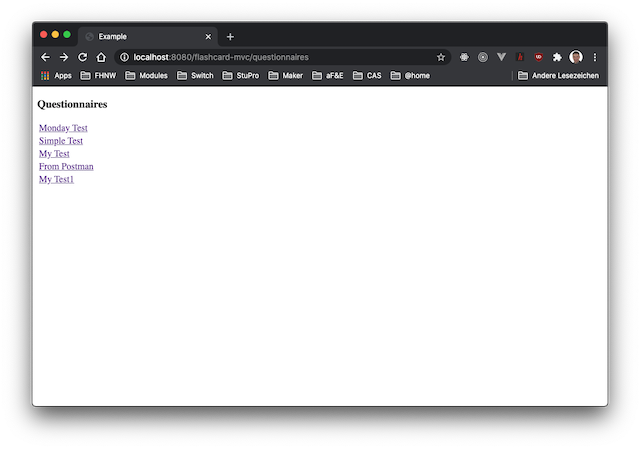
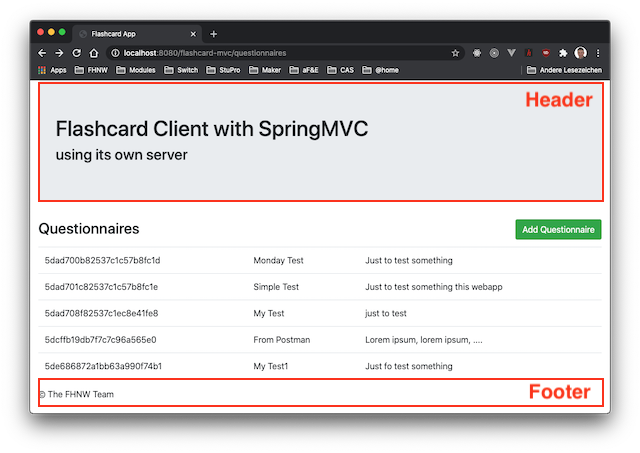
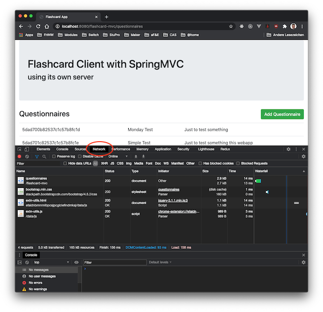

# Lektion 4: View Technologien

## Einleitung
In dieser Lektion liegt der Schwerpunkt auf dem `View` im Design Pattern MVC. Zusammen mit der View muss auch das `Model` thematisiert werden. 

Es ist wichtig zu erkennen und zu verstehen, dass bei dieser Art von Webapplikation alles, bis zu Generierung der HTML-Response, auf dem Server ausgeführt wird. Der Browser stellt lediglich die HTML-Response dar. Es gibt keine Applikationslogik im Browser.

## Ressourcen
Die Slides zu dieser Lektion sind auf [MS Teams](https://teams.microsoft.com/_#/school/files/Allgemein?threadId=19%3AGUtpEacwnFN-v0_PeG-fdUzDooai_4HhL8QwKr7hnRk1%40thread.tacv2&ctx=channel&context=04&rootfolder=%252Fteams%252Fwebfr_M365%252FFreigegebene%2520Dokumente%252FGeneral%252F04) abgelegt. Die Slides gibt es in 2 Versionen:

* eine druckbare Version unter Tab *Dateien* im Ordner `04`
* eine vertonte Version im gleichen Ordner.

Alle Arbeitsblätter finden sie ebenfalls auf [MS Teams](https://teams.microsoft.com/_#/school/files/Allgemein?threadId=19%3AGUtpEacwnFN-v0_PeG-fdUzDooai_4HhL8QwKr7hnRk1%40thread.tacv2&ctx=channel&context=04&rootfolder=%252Fteams%252Fwebfr_M365%252FFreigegebene%2520Dokumente%252FGeneral%252F04). Der Quellcode eines Arbeitsblattes und auch die jeweiligen Lösungen werden über Gitlab bereitgestellt.
 
Hier ein paar Links aus dem Internet, die aus meiner Sicht nützlich und aktuell sind:
* aus der "Reference Documentation Spring MVC" das Kapitel [View Technologies](https://docs.spring.io/spring/docs/current/spring-framework-reference/web.html#mvc-view)
* View Technology [Thymeleaf](https://www.thymeleaf.org/)

## Theorie
[Spring MVC](https://docs.spring.io/spring/docs/current/spring-framework-reference/web.html#mvc) unterstützt verschiedene View-Technologie. Dabei ist `Thymeleaf` eine Technologie, die sehr gut und elegant in das Spring Framework integriert ist. Mit einer solchen View-Technolgie ist es möglich allen HTML-Code aus dem Java-Code zu eliminieren.

`Thymeleaf` stellt auch die Möglichkeit bereit, das User Interface zu strukturieren, damit auch der View-Layer so implemetiert werden kann, dass er wartbar und erweiterbar bleibt.

Mit `Thymeleaf` lassen sich auch sehr gut folgende Design Patterns umsetzen:

* [Template View](https://www.martinfowler.com/eaaCatalog/templateView.html)
* [Composite View](https://www.oracle.com/java/technologies/composite-view.html)

Es ist wichtig, dass sie diese Patterns verstehen und korrekt mit Thymeleaf einsetzen können. Nach dieser Lektion sollten sie folgende Fragen beantworten können:

* Wie kann man den View-Layer strukturieren?
* Welche Rolle spielt das `Model`?
* Wie kann die `View` auf das `Model` zugreifen?
* Wie ist die Beziehung zwischen Controller - Model - View?
* Wie ist der Ablauf auf dem Server von der Verarbeitung eines HTTP-Requests bis zum Senden der HTML-Response?
* Wie kann Spring die Beziehung auflösen zwischen:
    * URL und entsprechender Handler-Methode des Page Controller's?
    * Response der Handler-Methode und entsprechender View?

## Arbeitsblätter
**Arbeiten sie in einem 2er-Team. Es macht mehr Spass!**

### AB10
In diesem Arbeitsblatt wird das `Template View Pattern` eingeführt, um den HTML-Code aus dem Page Controller streichen zu können. Sie werden erkennen, dass die View Technologie `Thymeleaf` diesen Template-Ansatz sehr elegant unterstützt.

Die Flashcard-Applikation wird so umgeschrieben, dass die Liste der Questionnaire wie in Abbildung 1 dargestellt wird, aber so dass jeder HTML-Code aus dem Page Controller entfernt werden kann.

Abbildung 1: Resultierende Webpage

### AB11
In diesem Arbeitsblatt wird das `Composite View Pattern` eingeführt. Diese Pattern hilft eine Page zu strukturieren, so dass sich wiederholende Komponente wie Header oder Footer als separate UI-Fragmente auslagern und bei Bedarf importieren lassen. Änderungen z.B. im Header werden dann auf allen entsprechenden Webpages sichtbar, da diese Headers immer auf das gleiche Fragment verweisen.

Das User Interface wird mit diesem Pattern strukturiert und erhält eine Hierarchie (siehe Abbildung 2). Sie finden dazu mehr auf:
* [Thymeleaf Page Layouts](https://www.thymeleaf.org/doc/articles/layouts.html).
* [Flexible layouts: beyond mere fragment insertion](https://www.thymeleaf.org/doc/tutorials/3.0/usingthymeleaf.html#flexible-layouts-beyond-mere-fragment-insertion)

Abbildung 2: Resultierende Webpage mit Header und Footer als separate UI-Fragmente

### AB12
Sie ergänzen die Applikation aus AB8 mit einem Formular "create.html", um eine neue Entität "Questionnaire" anlegen zu können. Das Formular muss dabei in das bestehende Layout integriert werden.

Entsprechend müssen sie auch den Page Controller erweitern. Beachten sie dabei, dass dieser Ablauf 2 HTTP Requests umfasst:
* GET, um Formular von Server zu laden
* POST, um die Daten der neuen Entität an den Server zu senden

Schauen sie mit den "Developer Tools" ihres Browsers die Netzwerk-Kommunikation an (siehe Abbildung 3). Entspricht die Sequenz ihren Erwartungen?

Abbildung 3: Aufzeichnung der Kommunikation über den "Network"-Tab

Testen suie folgendes: Setzen sie nach dem CREATE, d.h. nach dem POST-Request ein "Reload" aus dem Browser ab. Erhalten sie wieder die Liste der Questionnaire?
